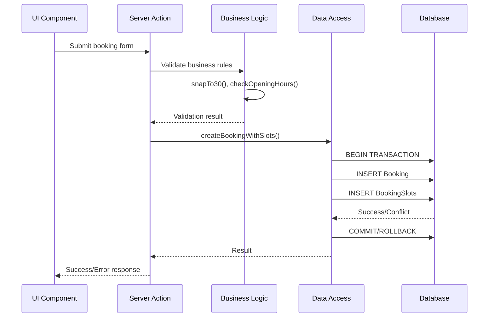

# NookBook - System Architecture Documentation

## Overview

NookBook is a room booking system built with Next.js 14 (App Router), TypeScript, and Prisma ORM. The architecture follows a layered approach with clear separation of concerns, ensuring scalability, maintainability, and testability.

## Architecture Layers

```
┌─────────────────────────────────────────────────────────┐
│                   Presentation Layer                     │
│            (Next.js Pages & React Components)            │
├─────────────────────────────────────────────────────────┤
│                    Application Layer                     │
│          (API Routes & Server Actions/Components)        │
├─────────────────────────────────────────────────────────┤
│                     Business Layer                       │
│              (Core Domain Logic - Pure Functions)        │
├─────────────────────────────────────────────────────────┤
│                   Data Access Layer                      │
│              (Prisma ORM & Database Queries)             │
├─────────────────────────────────────────────────────────┤
│                    Infrastructure Layer                  │
│                    (MySQL Database)                      │
└─────────────────────────────────────────────────────────┘
```

## Component Architecture

### 1. Presentation Layer

Located in `/app` and `/components`:

```typescript
// Server Components (default)
app / dashboard / availability / page.tsx // Server component for initial render
my - bookings / page.tsx // Server component with data fetching

// Client Components (interactive)
components / booking / BookingModal.tsx // 'use client' - handles user interactions
SlotGrid.tsx // 'use client' - interactive slot selection
FilterControls.tsx // 'use client' - filter state management
```

### 2. Application Layer

Handles HTTP requests and responses:

```typescript
// Server Actions (mutations)
app / actions / bookings.ts // createBooking, cancelBooking
rooms.ts // updateRoom, createRoom

// API Routes (queries)
app / api / availability / route.ts // GET availability data
bookings / route.ts // GET bookings list
```

### 3. Business Layer

Pure domain logic in `/core`:

```typescript
core / availability.ts // calculateAvailability()
opening - hours.ts // isWithinOpeningHours()
slots.ts // enumerateSlots(), snapTo30()
timezone.ts // convertToUTC(), convertToLocal()
```

### 4. Data Access Layer

Database operations in `/data`:

```typescript
data / bookings.ts // findBookings(), createBookingWithSlots()
rooms.ts // findRoomsByCapacity()
sites.ts // getAllSites()
```

## Data Flow Architecture

### Request Flow Example: Creating a Booking



## Database Architecture

### Schema Design Principles

1. **Normalization**: Properly normalized to 3NF
2. **Referential Integrity**: Foreign key constraints
3. **Concurrency Control**: Unique constraints for slot booking
4. **Audit Trail**: ActivityLog table for all mutations

### Key Tables and Relationships

```sql
User (1) ─────< (N) Booking (Owner)
User (1) ─────< (N) BookingAttendee
Site (1) ─────< (N) Room
Room (1) ─────< (N) Booking
Room (1) ─────< (N) BookingSlot
Booking (1) ───< (N) BookingSlot
Booking (1) ───< (N) BookingAttendee
```

### Concurrency Strategy

The `BookingSlot` table with unique constraint on `(roomId, slotStartUtc)` prevents double-booking:

```prisma
model BookingSlot {
  id          String   @id @default(cuid())
  bookingId   String
  roomId      String
  slotStartUtc DateTime

  @@unique([roomId, slotStartUtc]) // Prevents concurrent conflicts
}
```

## Authentication & Authorization Architecture

### Mock Authentication Flow

```typescript
// middleware.ts
export function middleware(request: NextRequest) {
  const userId = request.headers.get("x-user-id") || request.cookies.get("mock-user-id")

  if (!userId) {
    return NextResponse.redirect("/login")
  }

  // Attach user to request context
  request.headers.set("x-authenticated-user", userId)
}
```

### Authorization Layers

1. **Route Protection**: Middleware guards
2. **Action Authorization**: Server action validation
3. **Data Authorization**: Query-level filtering

## Caching Strategy

### Next.js Cache Layers

1. **Full Route Cache**: Static pages cached at build time
2. **Data Cache**: `fetch()` results cached with revalidation
3. **Request Memoization**: Deduplication within single request

### Cache Invalidation

```typescript
// After mutation
import { revalidateTag } from "next/cache"

async function createBooking(data: BookingInput) {
  // ... create booking

  // Invalidate related caches
  revalidateTag("availability")
  revalidateTag(`room-${data.roomId}`)
  revalidateTag(`user-${userId}-bookings`)
}
```

## API Architecture

### RESTful Design

```
GET    /api/availability?sites[]=SF&capacity=4
POST   /api/bookings
GET    /api/bookings?userId=xxx&scope=upcoming
DELETE /api/bookings/[id]
GET    /api/sites
POST   /api/sites
GET    /api/rooms?siteId=xxx
POST   /api/rooms
```

### Response Format

```typescript
// Success Response
{
  data: T,
  meta?: {
    page: number,
    total: number,
    hasMore: boolean
  }
}

// Error Response
{
  error: {
    code: string,
    message: string,
    details?: Record<string, any>
  }
}
```

## Error Handling Architecture

### Error Hierarchy

```typescript
class AppError extends Error {
  constructor(
    message: string,
    public code: string,
    public statusCode: number
  ) {}
}

class ValidationError extends AppError {
  constructor(
    message: string,
    public fields: Record<string, string>
  ) {
    super(message, "VALIDATION_ERROR", 400)
  }
}

class BookingConflictError extends AppError {
  constructor(public slot: string) {
    super(`Room already booked at ${slot}`, "BOOKING_CONFLICT", 409)
  }
}
```

### Error Boundaries

```tsx
// app/error.tsx - Route segment error boundary
"use client"

export default function Error({
  error,
  reset,
}: {
  error: Error & { digest?: string }
  reset: () => void
}) {
  return <ErrorDisplay error={error} onRetry={reset} />
}
```

## Performance Architecture

### Optimization Strategies

1. **Server Components by Default**: Minimize client bundle
2. **Dynamic Imports**: Code splitting for heavy components
3. **Image Optimization**: Next.js Image component
4. **Database Indexing**: Strategic indexes on query fields
5. **Connection Pooling**: Prisma connection management

### Database Indexes

```prisma
model Booking {
  @@index([roomId, startUtc])  // Availability queries
  @@index([ownerId, startUtc])  // User bookings list
}

model BookingSlot {
  @@unique([roomId, slotStartUtc])  // Concurrency control
  @@index([roomId, slotStartUtc])   // Availability queries
}
```

## Security Architecture

### Security Layers

1. **Input Validation**: Zod schemas at boundaries
2. **SQL Injection Prevention**: Prisma parameterized queries
3. **XSS Protection**: React automatic escaping
4. **CSRF Protection**: Server actions with POST
5. **Rate Limiting**: API route middleware

### Security Headers

```typescript
// next.config.ts
const securityHeaders = [
  {
    key: "X-Frame-Options",
    value: "SAMEORIGIN",
  },
  {
    key: "X-Content-Type-Options",
    value: "nosniff",
  },
  {
    key: "Referrer-Policy",
    value: "strict-origin-when-cross-origin",
  },
]
```

## Testing Architecture

### Test Pyramid

```
         /\
        /  \  E2E Tests (Critical paths)
       /    \
      /──────\ Integration Tests (API, DB)
     /        \
    /──────────\ Unit Tests (Business logic)
```

### Test Organization

```
tests/
  unit/
    core/           # Pure function tests
    utils/          # Utility function tests
  integration/
    api/           # API endpoint tests
    db/            # Database operation tests
  e2e/
    booking-flow/  # End-to-end user journeys
  fixtures/        # Test data factories
  helpers/         # Test utilities
```

## Deployment Architecture

### Environment Stages

1. **Development**: Local Docker MySQL
2. **Staging**: Production-like environment
3. **Production**: Scaled infrastructure

### Build Pipeline

```yaml
# CI/CD Pipeline
1. Lint & Type Check
2. Run Unit Tests
3. Run Integration Tests
4. Build Application
5. Run E2E Tests
6. Deploy to Staging
7. Smoke Tests
8. Deploy to Production
```

## Scalability Considerations

### Horizontal Scaling

- Stateless application servers
- Database read replicas
- Redis for session/cache
- CDN for static assets

### Vertical Scaling

- Database connection pooling
- Query optimization
- Batch operations
- Background job processing

## Monitoring & Observability

### Monitoring Layers

1. **Application Monitoring**: Error tracking (Sentry)
2. **Performance Monitoring**: APM tools
3. **Infrastructure Monitoring**: Server metrics
4. **Business Monitoring**: Booking metrics, utilization

### Key Metrics

- Response time percentiles (P50, P95, P99)
- Error rates by endpoint
- Database query performance
- Booking success/failure rates
- Room utilization rates

## Decision Records

### ADR-001: Server Actions for Mutations

**Status**: Accepted
**Context**: Need to handle form submissions and mutations
**Decision**: Use Next.js Server Actions instead of API routes for mutations
**Consequences**: Better DX, automatic CSRF protection, type safety

### ADR-002: Slot-based Concurrency Control

**Status**: Accepted
**Context**: Prevent double-booking under high concurrency
**Decision**: Use BookingSlot table with unique constraints
**Consequences**: Guaranteed consistency, slight storage overhead

### ADR-003: UTC Storage with Local Display

**Status**: Accepted
**Context**: Multi-timezone support required
**Decision**: Store all times in UTC, convert for display
**Consequences**: Consistent storage, complexity in UI layer

## Future Architecture Considerations

### Phase 2 Enhancements

- WebSocket support for real-time availability
- Microservices extraction for booking engine
- Event sourcing for audit trail
- GraphQL API layer
- Multi-tenancy support

### Technical Debt Items

- [ ] Implement connection pooling optimization
- [ ] Add distributed tracing
- [ ] Implement cache warming strategies
- [ ] Add database query analyzer
- [ ] Create performance regression tests

## Appendix: Technology Choices Rationale

| Technology | Choice       | Rationale                                |
| ---------- | ------------ | ---------------------------------------- |
| Framework  | Next.js 14   | Server Components, built-in optimization |
| Language   | TypeScript   | Type safety, better DX                   |
| Database   | MySQL 8      | ACID compliance, widespread support      |
| ORM        | Prisma       | Type-safe queries, migrations            |
| Styling    | Tailwind CSS | Rapid development, consistency           |
| Components | shadcn/ui    | Accessible, customizable                 |
| Testing    | Vitest       | Fast, ESM support                        |
| Validation | Zod          | Runtime + compile-time safety            |
